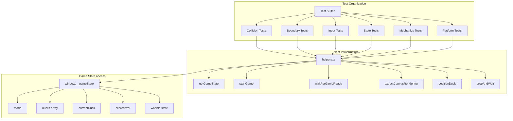

# Design Document: Comprehensive E2E Testing

## Overview

This design specifies a comprehensive end-to-end testing architecture for Psyduck's Infinite Headache using Playwright. The test suite will provide exhaustive coverage of all game mechanics, collision scenarios, boundary conditions, input methods, state transitions, and edge cases.

The testing approach combines:
- **Deterministic seeded tests**: Using fixed seeds for reproducible scenarios
- **Property-based validation**: Verifying invariants hold across many inputs
- **State machine testing**: Validating all game mode transitions
- **Boundary testing**: Exhaustive edge case coverage
- **Cross-platform testing**: Multi-browser and viewport validation

## Architecture



## Components and Interfaces

### Test Helper Module (helpers.ts)

Extended helper functions for comprehensive testing:

```typescript
interface TestHelpers {
  // Existing helpers
  waitForGameReady(page: Page): Promise<void>;
  startGame(page: Page): Promise<void>;
  expectCanvasRendering(page: Page): Promise<void>;
  getGameState(page: Page, path: string): Promise<any>;
  
  // New collision helpers
  positionDuckOverStack(page: Page, offsetFromCenter: number): Promise<number>;
  dropAndWaitForResult(page: Page, previousScore: number, timeout?: number): Promise<string>;
  
  // New boundary helpers
  moveDuckToEdge(page: Page, direction: 'left' | 'right'): Promise<number>;
  verifyDuckBounds(page: Page): Promise<{x: number, minX: number, maxX: number}>;
  
  // New state helpers
  waitForGameMode(page: Page, mode: GameMode): Promise<void>;
  triggerGameOver(page: Page): Promise<void>;
  triggerMerge(page: Page): Promise<void>;
  triggerLevelUp(page: Page): Promise<void>;
  
  // New input helpers
  simulateDrag(page: Page, fromX: number, toX: number): Promise<void>;
  simulateTouch(page: Page, action: TouchAction): Promise<void>;
  
  // Coordinate conversion
  designToScreen(page: Page, designX: number, designY: number): Promise<{x: number, y: number}>;
  screenToDesign(page: Page, screenX: number, screenY: number): Promise<{x: number, y: number}>;
}

type GameMode = 'MENU' | 'PLAYING' | 'GAMEOVER' | 'LEVELUP';
type TouchAction = 'start' | 'move' | 'end' | 'cancel';
```

### Test Suite Organization

```
tests/e2e/
├── helpers.ts                    # Extended test utilities
├── collision/
│   ├── swept-collision.spec.ts   # Swept collision detection tests
│   ├── perfect-landing.spec.ts   # Perfect landing zone tests
│   ├── miss-detection.spec.ts    # Miss and game over tests
│   └── scaled-collision.spec.ts  # Collision with grown ducks
├── boundaries/
│   ├── keyboard-bounds.spec.ts   # Arrow key boundary clamping
│   ├── drag-bounds.spec.ts       # Drag boundary clamping
│   ├── spawn-bounds.spec.ts      # Spawn position validation
│   └── resize-bounds.spec.ts     # Viewport resize handling
├── inputs/
│   ├── keyboard.spec.ts          # Keyboard input tests
│   ├── mouse.spec.ts             # Mouse click and drag tests
│   ├── touch.spec.ts             # Touch input tests
│   └── multi-input.spec.ts       # Combined input scenarios
├── states/
│   ├── game-modes.spec.ts        # Mode transition tests
│   ├── duck-states.spec.ts       # Duck state machine tests
│   └── ui-states.spec.ts         # UI visibility states
├── mechanics/
│   ├── merge.spec.ts             # Merge system tests
│   ├── levelup.spec.ts           # Level up progression tests
│   ├── wobble.spec.ts            # Wobble physics tests
│   ├── autodrop.spec.ts          # Auto-drop timer tests
│   ├── camera.spec.ts            # Camera follow tests
│   └── particles.spec.ts         # Particle system tests
├── seeded/
│   ├── reproducibility.spec.ts   # Seed reproducibility tests
│   └── seed-ui.spec.ts           # Seed input/copy tests
├── responsive/
│   ├── scaling.spec.ts           # Viewport scaling tests
│   └── design-width.spec.ts      # Design width calculation tests
├── visual/
│   ├── rendering.spec.ts         # Canvas rendering tests
│   └── animations.spec.ts        # Animation tests
├── edge-cases/
│   ├── rapid-input.spec.ts       # Rapid input handling
│   ├── timing-edge.spec.ts       # Timing edge cases
│   └── concurrent-events.spec.ts # Concurrent event handling
└── platform/
    ├── chromium.spec.ts          # Chromium-specific tests
    ├── firefox.spec.ts           # Firefox-specific tests
    ├── webkit.spec.ts            # WebKit-specific tests
    └── mobile.spec.ts            # Mobile viewport tests
```

### Collision Test Patterns

```typescript
// Swept collision test pattern
async function testSweptCollision(page: Page, scenario: CollisionScenario) {
  await startSeededGame(page, scenario.seed);
  
  // Position duck at specified offset from center
  await positionDuckOverStack(page, scenario.offsetFromCenter);
  
  // Capture pre-drop state
  const prevY = await getGameState(page, 'currentDuck.prevY');
  const targetY = await calculateTargetY(page);
  
  // Verify duck starts above target
  expect(prevY).toBeLessThan(targetY);
  
  // Drop and wait for result
  const result = await dropAndWaitForResult(page, 0);
  
  // Verify expected outcome
  expect(result.mode).toBe(scenario.expectedMode);
  if (scenario.expectedMode === 'PLAYING') {
    expect(result.score).toBe(1);
  }
}

interface CollisionScenario {
  seed: string;
  offsetFromCenter: number;
  expectedMode: 'PLAYING' | 'GAMEOVER';
  description: string;
}
```

### Boundary Test Patterns

```typescript
// Boundary clamping test pattern
async function testBoundaryClamping(page: Page, direction: 'left' | 'right') {
  await startSeededGame(page);
  
  const gameWidth = await getGameState(page, 'width');
  const duckW = await getGameState(page, 'currentDuck.w');
  const halfW = duckW / 2;
  
  // Push duck to boundary
  const iterations = 100;
  const key = direction === 'left' ? 'ArrowLeft' : 'ArrowRight';
  
  for (let i = 0; i < iterations; i++) {
    await page.keyboard.press(key);
  }
  
  const finalX = await getGameState(page, 'currentDuck.x');
  
  // Verify clamping
  if (direction === 'left') {
    expect(finalX).toBeGreaterThanOrEqual(halfW);
  } else {
    expect(finalX).toBeLessThanOrEqual(gameWidth - halfW);
  }
}
```

### State Transition Test Patterns

```typescript
// State machine test pattern
async function testStateTransition(
  page: Page, 
  fromState: GameMode, 
  trigger: () => Promise<void>,
  toState: GameMode
) {
  // Verify initial state
  const initialMode = await getGameState(page, 'mode');
  expect(initialMode).toBe(fromState);
  
  // Apply trigger
  await trigger();
  
  // Wait for and verify final state
  await waitForGameMode(page, toState);
  const finalMode = await getGameState(page, 'mode');
  expect(finalMode).toBe(toState);
}
```

## Data Models

### Test Configuration

```typescript
interface TestConfig {
  // Deterministic seeds for different test scenarios
  seeds: {
    collision: string;
    boundary: string;
    merge: string;
    levelUp: string;
    wobble: string;
  };
  
  // Timing constants
  timeouts: {
    duckFall: number;      // Time for duck to fall and land
    spawnDelay: number;    // Time between duck spawns
    autoDropBase: number;  // Base auto-drop timer
    animationSettle: number; // Time for animations to complete
  };
  
  // Game constants (mirrored from CONFIG)
  game: {
    duckBaseWidth: number;
    duckBaseHeight: number;
    hitTolerance: number;
    perfectTolerance: number;
    mergeThreshold: number;
    levelUpScreenRatio: number;
    arrowMovePx: number;
  };
}

const TEST_CONFIG: TestConfig = {
  seeds: {
    collision: 'collision-test-001',
    boundary: 'boundary-test-001',
    merge: 'merge-test-001',
    levelUp: 'levelup-test-001',
    wobble: 'wobble-test-001',
  },
  timeouts: {
    duckFall: 15000,
    spawnDelay: 2500,
    autoDropBase: 5000,
    animationSettle: 500,
  },
  game: {
    duckBaseWidth: 60,
    duckBaseHeight: 52,
    hitTolerance: 0.65,
    perfectTolerance: 8,
    mergeThreshold: 5,
    levelUpScreenRatio: 0.8,
    arrowMovePx: 15,
  },
};
```

### Collision Scenario Data

```typescript
interface CollisionTestCase {
  name: string;
  seed: string;
  offsetFromCenter: number;
  expectedOutcome: 'land' | 'perfect' | 'miss';
  description: string;
}

const COLLISION_TEST_CASES: CollisionTestCase[] = [
  {
    name: 'center-perfect',
    seed: 'collision-center',
    offsetFromCenter: 0,
    expectedOutcome: 'perfect',
    description: 'Duck lands perfectly centered',
  },
  {
    name: 'within-tolerance',
    seed: 'collision-tolerance',
    offsetFromCenter: 23, // Within hitTolerance but outside perfectTolerance
    expectedOutcome: 'land',
    description: 'Duck lands within hit tolerance',
  },
  {
    name: 'at-boundary',
    seed: 'collision-boundary',
    offsetFromCenter: 39, // At edge of hitTolerance (60 * 0.65 = 39)
    expectedOutcome: 'land', // Edge case - should still land
    description: 'Duck lands at exact boundary of hit tolerance',
  },
  {
    name: 'outside-tolerance',
    seed: 'collision-miss',
    offsetFromCenter: 50, // Outside hitTolerance
    expectedOutcome: 'miss',
    description: 'Duck misses stack entirely',
  },
];
```

### Viewport Test Data

```typescript
interface ViewportTestCase {
  name: string;
  width: number;
  height: number;
  expectedDesignWidth: number;
  description: string;
}

const VIEWPORT_TEST_CASES: ViewportTestCase[] = [
  { name: 'mobile-small', width: 375, height: 667, expectedDesignWidth: 412, description: 'Small mobile - floors to minimum' },
  { name: 'mobile-standard', width: 412, height: 915, expectedDesignWidth: 412, description: 'Standard mobile - exact minimum' },
  { name: 'tablet', width: 768, height: 1024, expectedDesignWidth: 768, description: 'Tablet - uses viewport width' },
  { name: 'desktop-medium', width: 800, height: 600, expectedDesignWidth: 800, description: 'Desktop at cap' },
  { name: 'desktop-large', width: 1280, height: 720, expectedDesignWidth: 800, description: 'Large desktop - caps at maximum' },
  { name: 'desktop-ultrawide', width: 1920, height: 1080, expectedDesignWidth: 800, description: 'Ultrawide - caps at maximum' },
];
```


## Correctness Properties

*A property is a characteristic or behavior that should hold true across all valid executions of a system—essentially, a formal statement about what the system should do. Properties serve as the bridge between human-readable specifications and machine-verifiable correctness guarantees.*

### Property 1: Swept Collision Landing Success

*For any* falling duck with x-position within hitTolerance of the top duck's center, when prevY is above targetY and y crosses below targetY, the duck SHALL land successfully and score SHALL increment.

**Validates: Requirements 1.1, 1.6**

### Property 2: Collision Miss Detection

*For any* falling duck with x-position outside hitTolerance of the top duck's center, when the duck crosses targetY, the game SHALL transition to GAMEOVER mode.

**Validates: Requirements 1.2**

### Property 3: Perfect Landing Snap

*For any* falling duck landing within perfectTolerance (8px) of the top duck's center, the landed duck's x-position SHALL snap to exactly match the top duck's x-position.

**Validates: Requirements 1.3**

### Property 4: Collision Zone Scaling

*For any* base duck that has grown via merges, the collision zone (hitTolerance * width) SHALL scale proportionally with the duck's width, allowing larger landing areas for larger ducks.

**Validates: Requirements 1.7, 5.8**

### Property 5: Keyboard Boundary Clamping

*For any* number of ArrowLeft or ArrowRight key presses, the duck's x-position SHALL remain within [halfWidth, width - halfWidth] bounds.

**Validates: Requirements 2.1, 2.2**

### Property 6: Drag Boundary Clamping

*For any* drag operation moving the duck beyond canvas boundaries, the duck's x-position SHALL be clamped to valid [halfWidth, width - halfWidth] range.

**Validates: Requirements 2.3, 2.4**

### Property 7: Spawn Position Bounds

*For any* seed and spawn event, the spawned duck's x-position SHALL be within [duckBaseWidth, width - duckBaseWidth] range.

**Validates: Requirements 2.6**

### Property 8: Space Key Drop Trigger

*For any* hovering duck (isFalling=false, isStatic=false), pressing Space SHALL immediately set isFalling=true.

**Validates: Requirements 3.1, 17.5**

### Property 9: Arrow Key Movement Amount

*For any* ArrowLeft or ArrowRight key press on a non-clamped duck, the duck's x-position SHALL change by exactly ARROW_MOVE_PX (15px) in the corresponding direction.

**Validates: Requirements 3.2, 3.3**

### Property 10: Click-on-Duck Drag Initiation

*For any* mouse click on a hovering duck's hitbox, isDragging SHALL become true and isBeingDragged SHALL become true.

**Validates: Requirements 3.4**

### Property 11: Click-Away Drop Trigger

*For any* mouse click outside a hovering duck's hitbox, isFalling SHALL become true.

**Validates: Requirements 3.5, 17.6**

### Property 12: Drag Release Drop

*For any* drag operation that ends (mouseup/touchend), isBeingDragged SHALL become false and isFalling SHALL become true.

**Validates: Requirements 3.6, 17.3**

### Property 13: Touch Drag State

*For any* touch start on a hovering duck, isDragging SHALL become true with correct touchIdentifier, and touch move SHALL update duck position.

**Validates: Requirements 3.7, 3.8, 3.9**

### Property 14: Menu to Playing Transition

*For any* click on the start button while in MENU mode, the game SHALL transition to PLAYING mode, start screen SHALL hide, and score box SHALL show.

**Validates: Requirements 4.1, 4.7**

### Property 15: Miss to GameOver Transition

*For any* duck that misses the stack (x outside hitTolerance), the game SHALL transition to GAMEOVER mode.

**Validates: Requirements 4.2**

### Property 16: Level Up Threshold Transition

*For any* base duck width >= width * 0.8, the game SHALL transition to LEVELUP mode and level SHALL increment.

**Validates: Requirements 4.4, 6.1, 6.2**

### Property 17: Continue to Playing Transition

*For any* click on continue button while in LEVELUP mode, the game SHALL transition back to PLAYING mode.

**Validates: Requirements 4.5**

### Property 18: Retry Seed Preservation

*For any* retry action after GAMEOVER, the game SHALL restart with the same seed and transition to PLAYING mode.

**Validates: Requirements 4.6, 9.6**

### Property 19: No Spawn in Non-Playing Modes

*For any* game in GAMEOVER or LEVELUP mode, no new duck spawning SHALL occur.

**Validates: Requirements 4.8, 4.9**

### Property 20: Merge Trigger at Threshold

*For any* mergeCount reaching 5 with at least 6 ducks in array, merge SHALL trigger, removing 5 stacked ducks and incrementing base duck mergeLevel.

**Validates: Requirements 5.1, 5.2, 5.3, 5.5**

### Property 21: Merge Growth Calculation

*For any* merge event, the base duck width SHALL grow according to the computeMergeGrowthRate formula based on design width and level.

**Validates: Requirements 5.4**

### Property 22: Merge Particle Spawn

*For any* merge event, particles SHALL spawn at the base duck position.

**Validates: Requirements 5.6**

### Property 23: Level Up Screen Display

*For any* level up event, the level up screen SHALL display with the new level number and level name from config.

**Validates: Requirements 6.3, 6.4, 12.7**

### Property 24: Difficulty Scaling with Level

*For any* level increase, spawn interval SHALL decrease, wobble multiplier SHALL increase, and auto-drop timer SHALL decrease (clamped at minimum).

**Validates: Requirements 6.6, 6.7, 6.8, 8.5, 8.6**

### Property 25: Wobble Impulse on Landing

*For any* successful duck landing, wobble physics SHALL receive an impulse affecting angular velocity.

**Validates: Requirements 7.1**

### Property 26: Imbalance Increases Instability

*For any* stack with non-zero imbalance (offset duck positions), wobble instability SHALL be greater than a balanced stack.

**Validates: Requirements 7.2**

### Property 27: Stability Bar Reflects State

*For any* wobble state, the stability bar width SHALL reflect the stability percentage, with appropriate CSS classes for warning (<60%) and critical (<30%) states.

**Validates: Requirements 7.6, 7.7, 7.8**

### Property 28: Auto-Drop Timer Behavior

*For any* spawned duck, auto-drop timer SHALL start, and if not manually dropped, duck SHALL transition to falling after timeout.

**Validates: Requirements 8.1, 8.2**

### Property 29: Manual Drop Clears Timer

*For any* manual drop action (Space, click, drag release), the auto-drop timer SHALL be cleared.

**Validates: Requirements 8.3, 8.4**

### Property 30: Seed Reproducibility

*For any* two game sessions with the same seed, spawn positions and level configs SHALL be identical.

**Validates: Requirements 9.1, 9.2**

### Property 31: Seed Input Usage

*For any* seed entered in the input field, the game SHALL use that exact seed for RNG.

**Validates: Requirements 9.3**

### Property 32: Shuffle Generates New Seed

*For any* click on shuffle button, a new seed SHALL be generated and displayed in the input.

**Validates: Requirements 9.4**

### Property 33: Game Over Seed Display

*For any* game over event, the displayed seed SHALL match the active game seed.

**Validates: Requirements 9.5**

### Property 34: Camera Target Update on Landing

*For any* successful duck landing, targetCameraY SHALL update to keep the new top duck at approximately 70% screen height.

**Validates: Requirements 10.1, 10.3**

### Property 35: Camera Smooth Interpolation

*For any* change in targetCameraY, cameraY SHALL smoothly interpolate toward the target over multiple frames.

**Validates: Requirements 10.2**

### Property 36: Camera Reset on Restart

*For any* game restart, cameraY and targetCameraY SHALL reset to 0.

**Validates: Requirements 10.4**

### Property 37: Design Width Clamping

*For any* viewport width, designWidth SHALL be clamped to [412, 800] range: min(max(viewportWidth, 412), 800).

**Validates: Requirements 11.1, 11.2, 11.3**

### Property 38: Scale Factor Calculation

*For any* viewport, scale factor SHALL equal viewportWidth / designWidth.

**Validates: Requirements 11.4**

### Property 39: Canvas Physical Resolution

*For any* viewport, canvas physical dimensions SHALL equal viewport dimensions * devicePixelRatio.

**Validates: Requirements 11.5**

### Property 40: GameOffsetX Invariant

*For any* viewport size, gameOffsetX SHALL always be 0.

**Validates: Requirements 11.6**

### Property 41: Score Display Updates

*For any* game start, score display SHALL show 0, and for any successful landing, score display SHALL update to match game state score.

**Validates: Requirements 12.1, 12.2**

### Property 42: High Score Persistence

*For any* score exceeding high score, localStorage SHALL be updated with the new high score.

**Validates: Requirements 12.3**

### Property 43: Help Screen Toggle

*For any* help button click, help screen SHALL show, and for any help close button click, help screen SHALL hide.

**Validates: Requirements 12.4, 12.5**

### Property 44: Game Over Screen Display

*For any* game over event, game over screen SHALL display with correct final score, level, and seed.

**Validates: Requirements 12.6**

### Property 45: Canvas Rendering Verification

*For any* game in PLAYING mode, canvas SHALL not be all-black (at least some pixels have non-zero RGB values).

**Validates: Requirements 14.1, 14.2**

### Property 46: Rapid Input State Consistency

*For any* sequence of rapid inputs (keyboard, mouse, touch), game state SHALL remain consistent without corruption.

**Validates: Requirements 15.2, 15.4**

### Property 47: Particle Lifecycle

*For any* particle with life <= 0, the particle SHALL be removed from the particles array.

**Validates: Requirements 16.2, 19.3**

### Property 48: Spawn Timing

*For any* successful landing in PLAYING mode, a new duck SHALL spawn after the level's spawn interval.

**Validates: Requirements 16.3**

### Property 49: Duck Initial State

*For any* newly spawned duck, isFalling SHALL be false, isStatic SHALL be false, and isBeingDragged SHALL be false.

**Validates: Requirements 17.1**

### Property 50: Duck Drag State

*For any* duck being dragged, isBeingDragged SHALL be true and isFalling SHALL be false.

**Validates: Requirements 17.2**

### Property 51: Duck Landed State

*For any* duck that has landed, isStatic SHALL be true and isFalling SHALL be false.

**Validates: Requirements 17.4**

### Property 52: Squish Animation on Landing

*For any* successful landing, the landed duck's scaleY SHALL temporarily decrease and scaleX SHALL temporarily increase, then recover to 1.0.

**Validates: Requirements 18.1, 18.2, 18.3**

### Property 53: Perfect Landing Particles

*For any* perfect landing (within perfectTolerance), particles SHALL spawn at the landing position.

**Validates: Requirements 19.1**

### Property 54: Cross-Browser Core Mechanics

*For any* supported browser (Chromium, Firefox, WebKit), core game mechanics (collision, landing, scoring) SHALL function correctly.

**Validates: Requirements 20.1, 20.2, 20.3**

### Property 55: Platform-Specific Controls

*For any* mobile viewport, touch controls SHALL work correctly, and for any desktop viewport, keyboard controls SHALL work correctly.

**Validates: Requirements 20.4, 20.5**

## Error Handling

### Test Failure Handling

```typescript
// Graceful test skip for timing-sensitive scenarios
async function safeDropAndVerify(page: Page, expectedOutcome: 'land' | 'miss') {
  try {
    const result = await dropAndWaitForResult(page, 0, 15000);
    if (expectedOutcome === 'land') {
      expect(result.mode).toBe('PLAYING');
    } else {
      expect(result.mode).toBe('GAMEOVER');
    }
  } catch (error) {
    // If timing causes unexpected result, skip gracefully
    if (error.message.includes('timeout')) {
      test.skip(true, 'Timing-sensitive test failed due to rAF scheduling');
    }
    throw error;
  }
}
```

### Browser-Specific Handling

```typescript
// Skip tests that don't work on specific browsers
test.beforeEach(async ({ page }, testInfo) => {
  // Firefox has slower rAF timing in headless mode
  if (testInfo.project.name === 'firefox' && isGravityTest) {
    test.skip(true, 'Firefox headless rAF timing too slow for gravity physics');
  }
  
  // Mobile projects don't have keyboard
  if (testInfo.project.name.startsWith('mobile') && isKeyboardTest) {
    test.skip(true, 'Keyboard input not available on mobile');
  }
});
```

### State Recovery

```typescript
// Ensure clean state between tests
test.afterEach(async ({ page }) => {
  // Clear any pending timers
  await page.evaluate(() => {
    // Clear auto-drop timer if exists
    if ((window as any).__autoDropTimer) {
      clearTimeout((window as any).__autoDropTimer);
    }
  });
});
```

## Testing Strategy

### Dual Testing Approach

The test suite uses both unit tests and property-based E2E tests:

- **Unit tests** (Vitest): Test pure game logic functions in isolation
- **Property-based E2E tests** (Playwright): Verify properties hold across browser environments

### Property-Based Testing Configuration

```typescript
// playwright.config.ts additions
export default defineConfig({
  // Run each property test multiple times with different seeds
  repeatEach: 3,
  
  // Retry flaky tests
  retries: 2,
  
  // Parallel execution
  workers: process.env.CI ? 2 : undefined,
  
  projects: [
    { name: 'chromium', use: { ...devices['Desktop Chrome'] } },
    { name: 'firefox', use: { ...devices['Desktop Firefox'] } },
    { name: 'webkit', use: { ...devices['Desktop Safari'] } },
    { name: 'mobile-chrome', use: { ...devices['Pixel 5'] } },
    { name: 'mobile-safari', use: { ...devices['iPhone 12'] } },
  ],
});
```

### Test Tagging Convention

Each property test includes a comment referencing the design property:

```typescript
/**
 * Feature: comprehensive-e2e-testing
 * Property 1: Swept Collision Landing Success
 * For any falling duck with x-position within hitTolerance...
 */
test('swept collision: duck lands when within hit tolerance', async ({ page }) => {
  // Test implementation
});
```

### Coverage Goals

- **Collision scenarios**: 100% of collision paths tested
- **Boundary conditions**: All edge clamping verified
- **State transitions**: All mode transitions covered
- **Input methods**: Keyboard, mouse, touch all tested
- **Viewports**: Mobile (375px) to desktop (1920px) range
- **Browsers**: Chromium, Firefox, WebKit

### Test Execution

```bash
# Run all E2E tests
pnpm test:e2e

# Run specific test file
pnpm test:e2e tests/e2e/collision/swept-collision.spec.ts

# Run with specific browser
pnpm test:e2e --project=chromium

# Run with UI for debugging
pnpm test:e2e:ui
```
